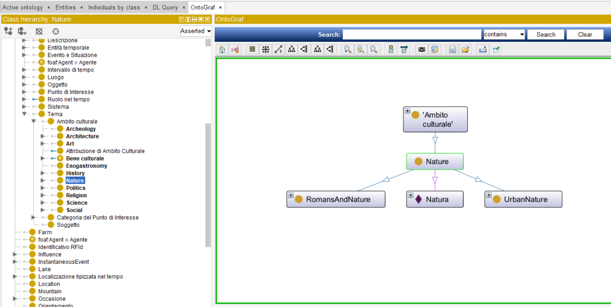
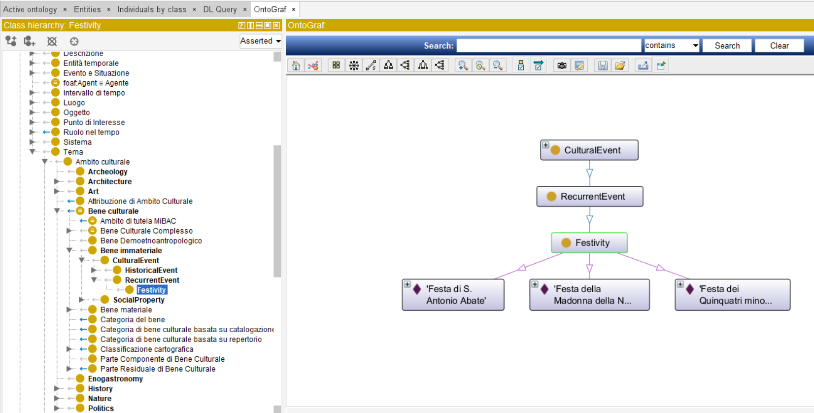
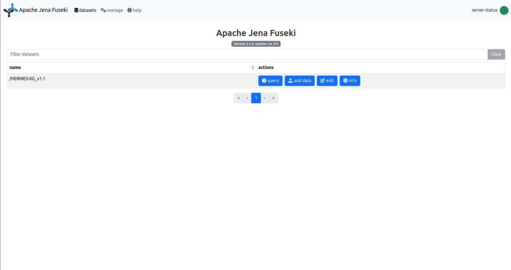
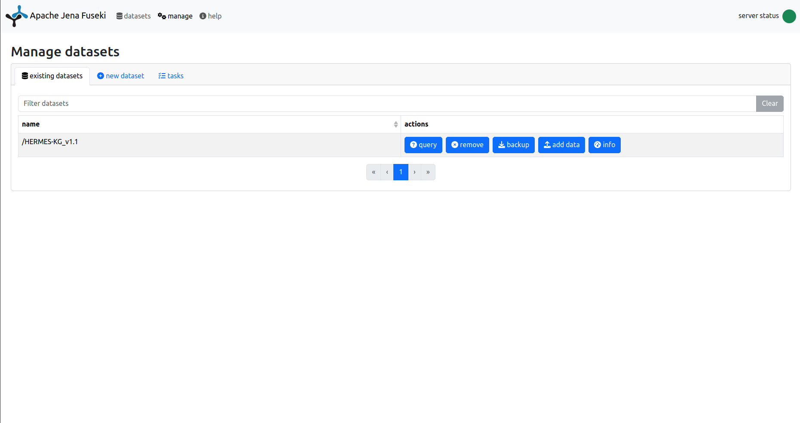
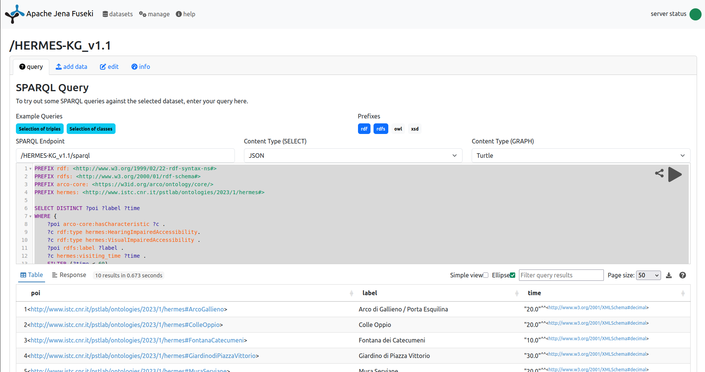

e# HerMeS Ontology
An ontology to support thematic descriptions of cultural heritage

## Introduction

This repository contains the ontological structure and the knowledge graph used within the [HerMeS project](https://hermes.cnr.it/progetto/), an initiative by the CNR and DigiLab Sapienza aimed at the management and enhancement of cultural heritage through semantic technologies.

## Main content

🔹hermes_ontology_v1.1.rdf → This is the HerMeS Ontology: a formal definition of the concepts and relationships used within the project's domain.

🔹hermes_kg_rome_rMonti_v1.1.rdf → This is the HerMeS Knowledge Graph (KG): a representation of cultural heritage data based on the HerMeS ontology. The dataset includes 100 tangible and intangible cultural entities distributed across two Roman districts: Rione Monti and Rione Esquilino.

## How to use

If you don't already have an ontology editor, we recommend using Protégé (Version 5.6.5) — a free and open-source tool — to explore the files. You can install Protégé by following the instructions available [here](https://protege.stanford.edu/software.php).

To explore the HerMeS ontological structure:

1️⃣ Download the ontology file hermes_ontology_v1.0.rdf

2️⃣ Open it with Protégé or any other ontology editor
*Note: When opening the ontology you may see a warning about failed imports. This can be safely ignored, as some ontologies imported by ArCo—such as w3id.org/arco/ontology/immovable-property/0.2 might be deprecated or temporarily unavailable.*

3️⃣ Navigate through the ontology. Example: Search for the subclass "Nature", open OntoGraf, and explore how it relates to other classes.



To explore the HerMeS Knowledge Graph, including individuals from Rione Monti and Rione Esquilino:

1️⃣ Download the file hermes_kg_rome_rMonti_v1.0.rdf.

2️⃣ Open it with Protégé or any other ontology editor.
*Note: When opening the ontology you may see a warning about failed imports. This can be safely ignored, as some ontologies imported by ArCo—such as w3id.org/arco/ontology/immovable-property/0.2 might be deprecated or temporarily unavailable.*

3️⃣Explore the knowledge graph. Example: Search for the class "Festivity", open OntoGraf, and examine the individuals that are part of this class




### Running a SPARQL Endpoint

To interact with an instance of the knowledge graph it is possible to setup a SPARQL Endpoint using the framework [Apache Fuseki](https://jena.apache.org/documentation/fuseki2/). In addition to the official documentation of the framework, it is available a Docker image that can be easily configured to expose Fuseki services thorugh an intuitive web application.

To do so, first be sure to have a Docker enginer installed and correctly running on the host machine. Follow the [Docker documentation](https://docs.docker.com/engine/install/) for the installation if necessary.

When docker is correctly running on you machine, downalod the latest ```stain/jena-fuseki``` image from the [Docker Hub](https://hub.docker.com/r/stain/jena-fuseki)

```bash
docker pull stain/jena-fuseki
```
When the image is available, you can run a new Docker container from the image to instantiate the Fuseki SPARQL endpoint.

```bash
docker run -p 3030:3030 -e ADMIN_PASSWORD=<PWD> --restart unless-stopped --name fuseki stain/jena-fuseki 
```

The command above creates a container with ```--name``` fuseki on the host machine. The container is created from the image ```stain/jena-fuseki``` and is reachable thorugh the port ```3030``` of the host machine. Specifically, the docker command maps the host port ```3030``` to the container port ```3030``` where the Fuseki endpoint actually runs. 

Be sure that the port ```3030``` of the host machine is free and not used by another process. In such a case you can easily change the port mapping ```-p``` of the command by using a port you know is available e.g., ```-p 3131:3030```.

The access to the SPARQL endpoint requires admin authentication, the parameter ```-e ADMIN_PASSWORD=<PWD>``` allows to specify the password to use. Replace ```<PWD>``` with the password you intend to use for authentication.

Now the container is running and you can access the endpoint at ```http://localhost:3030``` using your browser.




To create a new dataset, go to the page 'manage' and click on 'new dataset' by specyfing a name e.g., 'HERMES-KG_v1.1'. At this point, the page 'manage' should like the picture below.



Click on the button 'add data' to upload the triples of the HERMES knowledge graph in this repository. To correctly use the version __v1.1__ you should upload both the knowledge graph  ```hermes_kg_rMonti_v1.1.rdf``` and the ontology ```hermes_ontology_v1.1.rdf```. This is necessary to import the ontology into the memory of fuseki since the 'import' commands are not automatically processed by the endpoint.




When both files have been uploaded you can go to the 'query' page to interact with the knowledge by processing some SPARQL queries. The figure above shows the 'query' page and the results obtained by processing the following SPARQL query.

```sparql
PREFIX rdf: <http://www.w3.org/1999/02/22-rdf-syntax-ns#>
PREFIX rdfs: <http://www.w3.org/2000/01/rdf-schema#>
PREFIX arco-core: <https://w3id.org/arco/ontology/core/>
PREFIX hermes: <http://www.istc.cnr.it/pstlab/ontologies/2023/1/hermes#>

SELECT DISTINCT ?poi ?label ?time
WHERE {	
    ?poi arco-core:hasCharacteristic ?c .
    ?c rdf:type hermes:HearingImpairedAccessibility.
    ?c rdf:type hermes:VisualImpairedAccessibility .
    ?poi rdfs:label ?label .
    ?c hermes:visiting_time ?time .
    FILTER (?time < 60)
}
```


## About HerMeS Ontology

Cultural heritage is the aggregation of multiple and heterogeneous facets of a certain society, territory, and historical background. A cross-thematic approach to cultural heritage is necessary to provide users (e.g., tourists) with a detailed description of habits, traditions, places, events, and connections with other cultures. It is necessary to characterize the geographic and structural features, as well as the cultural qualities, of tangible entities that are part of a specific territory and are relevant from a heritage perspective. However, it is equally important to characterize intangible cultural entities that correlate with the tangibles of a territory and may identify ``semantic connections'' with other cultures and traditions.

The ability to semantically correlate intangibles with tangibles is key to unlocking hidden relationships between places, history, religion, food, and local traditions. In this context, the __HERMES Ontology__ is the result of a research effort aiming at supporting a multiperspective description of cultural entities and their semantic correlations with the intangible heritage. HERMES is a domain ontology \[1\] based on a solid theoretical background defined by DOLCE \[2\], and extending the ontological model ArCo \[3\].

## Design of HerMes ontology and knowledge graph

The design of the HERMES ontology and the resulting knowledge graph was guided by the requirements collected within the project and by applying structured knowledge engineering methodologies \[4\]. The process identified the following criteria as crucial for the proper characterization of cultural entities (generally referred to as Points of Interest - POIs):

- Geographical location: In which area/territorial unit is the POI located? And which transport infrastructures are available in that area? (Eg. Bus, Train/Metro stations, parking, etc.). Geographic location is key to grouping POIs within Territorial Units (characterized by a range of infrastructure) that will define the area within which the planner can choose POIs in the route generation phase.
- Type: POIs are distinguished into two macro-types: tangibles and intangibles. This distinction is crucial for generating tourist itineraries that include not only physical monumental units but also experiences, and ephemeral performances of traditional manifestations that are part of the cultural heritage of a given place.
- Topic: POIs are linked to thematic/topic-based descriptions characterizing the entity from a certain perspective. \HerMeS\ interprets the description of a cultural entity as the aggregation of multiple topic-based descriptive contents. The same POI/entity is thus described according to multiple thematic axes. For example, a church might be described from (synergetic) historical, artistic, architectural, and religious perspectives.
- Visiting time: each POI has an estimated visiting time, this is needed to generate itineraries based on a given time range. Eg. The user has only four hours to be able to carry out the itinerary.
- Inclusive accessibility: each POI, wherever possible, is enriched with information related to inclusive accessibility, to address questions such as: Is the POI accessible to groups, elderly, or people with motor, visual, or hearing disability?
\end{itemize}

The design process considered also the integration of structured meta-information to support the authoring of cultural information. HERMES specifically integrates the PROV-O ontology \[5\] to represent meta-information about editing activities of cultural entities in a knowledge graph. In addition, several refinements of the ArCO ontological model have been considered to better support the layered and thematic correlation of tangible and intangible cultural entities. Such extensions concern: (i) the introduction of new classes (TerritorialUnit, TopographicContext, MonumentalUnit, CulturalPropertyDescription, etc.); (ii) the refinement of existing classes (CulturalPropertyResidual, IntangibleCulturalProperty, Topic), and; (iii) the introduction of new data and object properties (visiting\_time, inclusive\_accessibility, etc.). 


## References

\[1\] N. Guarino, "Understanding, building and using ontologies", International Journal of Human-Computer Studies, 46(2), 1997.

\[2\] S. Borgo, R. Ferrario, A. Gangemi, N. Guarino, C. Masolo, D. Porello, E.M. Sanfilippo and L. Vieu, "DOLCE: A descriptive ontology for linguistic and cognitive engineering", Applied Ontology 17(1), 2022.

\[3\] V.A. Carriero, A. Gangemi, M.L. Mancinelli, L. Marinucci, A.G. Nuzzolese, V.. Presutti and C. Veninata, "ArCo: The Italian Cultural Heritage Knowledge Graph", in: "The Semantic Web – ISWC 2019", 2019.

\[4\] M. Poveda-Villalón, A. Fernández-Izquierdo, M. Fernández-López, R. García-Castro "LOT: An industrial oriented ontology engineering framework", Engineering Applications of Artificial Intelligence, 111, 2022.

\[5\] P. Missier, K. Belhajjame and J. Cheney "The W3C PROV family of specifications for modelling provenance metadata", in: Proceedings of the 16th International Conference on Extending Database Technology, 2013
